# Artuisis swarm simulator

The aim of this project is to study interaction with swarms of robots, using a simulation of a swarm of robots. This project has been developed in order to study the mechanisms of swarm self-organisation, to study human perception of swarms, human control of swarms, and the development of visualisations localised on the swarm to help the human.

To this end, this project proposes a multi-agent simulator for simulating the behaviour of swarms of robots, implemented using the Unity game engine (https://unity.com). Different swarm behaviours are implemented, and can be controlled using the various associated parameters. In particular, this simulator allows simulation extracts to be recorded, so that they can be replayed or the simulation restarted from a recording frame. The simulator can also be used to display various swarm visualisations, whether for real-time simulation or for viewing recordings. 

This documentation explains how the simulator works, as well as the structure of the project code.

## Table of contents

* [Software](#software)
* [Installation](#installation)
* [Project Files](#project-files)
* [Unity scenes](#unity-scenes)
* [Architecture](#architecture)
* [How to](#how-to)

## Software 

Software | Version
 --- | --- |
Unity | 2023.1.11f1

## Installation 

To use this project, the [Unity](https://unity.com) editor must be installed with the version indicated above. Then download or clone this repository, and import it into the Unity Hub. As some of the meshes in this project are in .blend format, [Blender](https://www.blender.org/) must be installed for Unity to be able to open them.
Nothing else is required.

## Project Files 
This section aims to briefly define the purpose of the main folders.

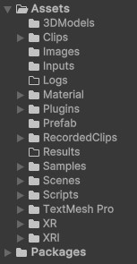

The [_Assets_](./Assets) folder contains various sub-folder :
* [_3DModels_](./Assets/3DModels) contains imported meshes designed outside the unity editor (e.g. from _Blender_)
* [_Clips_](./Assets/Clips) contains simulation recording. This folder is used during experiments to load the desired recordings. 
* [_Images_](./Assets/Images/) contains image files, such as textures.
* [_Logs_](./Assets/Logs) is used by some scripts to store log files.
* [_Material_](./Assets/Material) contains the Unity materials used in the project. It can contain sub-folders containing materials extracted from the imported meshes stored in _3DModels_ folder.
* [_Plugins_](./Assets/Plugins) contains external addons used. It currently contains an addon that allows to browse and load files using Windows File Explorer.
* [_Prefab_](./Assets/Prefab) contains all the Unity prefab used in the project.
* [_RecordedClips_](./Assets/RecordedClips) contains the simulation recordings with a .dat extension. When a simulation is recorded, the corresponding file is stored in this folder.
* [_Results_](./Assets/Results) contains the generated experimental result files.
* [_Scenes_](./Assets/Scenes) contains the project scenes. The main files are stored directly in this folder. Secondary files, such as experimental scenes, are stored in sub-folders.
* [_Scripts_](./Assets/Scripts/) contains all the project scripts.
* [_Samples_](./Assets/Samples), [_TextMesh Pro_](./Assets/TextMesh%20Pro), [_XR_](./Assets/XR), [_XRI_](./Assets/XRI) (and [_Packages_](./Packages) which is not contained in _Assets_ folder) are folder resulted from the importation of Unity packages from the Unity Package manager.

### Scripts folder files

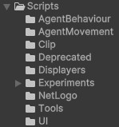

The _Scripts_ folder contains various sub-folder :
* [_AgentBehaviour_](./Assets/Scripts/AgentBehaviour) contains scripts related to the behaviour of the swarm agents. As this simulator used virtual forces to generate agents movement, this folder contains a script named [**BehaviourRules.cs**](./Assets/Scripts/AgentBehaviour/BehaviourRules.cs) which gathers together the various behavioural rules that generate forces. The other file named [**BehaviourManager.cs**](./Assets/Scripts/AgentBehaviour/BehaviourManager.cs) contains various swarm models based on multiple rules from the previous files. A single swarm model is used at a time to drive the swarm.
* [_AgentMovement_](./Assets/Scripts/AgentMovement) contains scripts that move the swarm agents, based on the resulting force generated by the behaviour manager previously described. This folder contains two scripts named [**MovementManager.cs**](./Assets/Scripts/AgentMovement/MovementManager.cs) and [**SimulatedMonaMovement.cs**](./Assets/Scripts/AgentMovement/SimulatedMonaMovement.cs), designed to group together different ways of moving an agent. Two movements are currently implemented, the _particule_ and the _MonaRobot_ movement. To simulate other realistic robot movement, other types of movement should be implemented.
* [_Clips_](./Assets/Scripts/Clip) contains all the scripts related to the clip system. A clip is a recording of the swarm simulation. More precisely, its a serialized C# object (cf. [**SwarmClip.cs**](./Assets/Scripts/Clip/SwarmClip.cs) script) stored in a .dat file. Here is a short summary of the files contained in this folder :
    * [**ClipEditor.cs**](./Assets/Scripts/Clip/ClipEditor.cs) aims to play and modify clips in the _ClipEditor_ scene.
    * [**ClipFeaturesExtractor.cs**](./Assets/Scripts/Clip/ClipFeaturesExtractor.cs) exports various features of the clips contained in the _Clips_ folder, in a .csv format file.
    * [**ClipMetrics.cs**](./Assets/Scripts/Clip/ClipMetrics.cs) contains various metrics based on clips. They are notably used in the [**ClipFeaturesExtractor.cs**](./Assets/Scripts/Clip/ClipFeaturesExtractor.cs) script.
    * [**ClipPlayer.cs**](./Assets/Scripts/Clip/ClipPlayer.cs) is the script used to play and display a clip using various selected visualisations.
    * [**ClipRecorder.cs**](./Assets/Scripts/Clip/ClipRecorder.cs) is the script used to record a clip from the _SimulationScene_ scene.
    * [**ClipsTools.cs**](./Assets/Scripts/Clip/ClipTools.cs) contains various clip-related methods.
    * [**FrameTransmitter.cs**](./Assets/Scripts/Clip/FrameTransmitter.cs) is a script used to transfer a clip from one scene to another.
    * [**SwarmClip.cs**](./Assets/Scripts/Clip/SwarmClip.cs) is the clip script.
* [_Deprecated_](./Assets/Scripts/Deprecated) folder contains old, unused scripts that could potentially be updated. 
* [_Displayer_](./Assets/Scripts/Displayers) folder contains scripts for displaying agents and other visualisations. The abstract class of the [**Displayer.cs**](./Assets/Scripts/Displayers/Displayer.cs) script is the main component of this folder. The other scripts are various implementation of this class. They are used in the simulator to display visualisations, using the abstract shared method called **DisplayVisual**.
* [_Experiments_](./Assets/Scripts/Experiments) folder contains the scripts used only during experiments.
* [_Tools_](./Assets/Scripts/Tools) folder contains various tool files.
* [_UI_](./Assets/Scripts/UI) folder contains scripts related to the user interface management.

The _Scripts_ folder also contains directly scripts files, mostly related to the swarm data model :
* [**AgentData.cs**](./Assets/Scripts/Agentdata.cs) contains the data related to an agent.
* [**SwarmData.cs**](./Assets/Scripts/SwarmData.cs) contains the data related to a swarm (notably composed of multiple agents)
* [**SwarmMetrics.cs**](./Assets/Scripts/SwarmMetrics.cs) contains various metrics used with the swarm data.
* [**SwarmParameters.cs**](./Assets/Scripts/SwarmParameters.cs) contains the various parameters used to influence the swarm.
* [**SwarmTools.cs**](./Assets/Scripts/SwarmTools.cs) contains various tools related to swarm data.
* [**SwarmManager.cs**](./Assets/Scripts/SwarmManager.cs) is the script managing the swarm simulation, used in the _SimulationScene_ scene.
* [**SerializableRandom.cs**](./Assets/Scripts/SerializableRandom.cs) is a random generator based on the _MRG32k3a_ algorithm.
* [**SerializableVector3.cs**](./Assets/Scripts/SerializableVector3.cs) is a serializable version of a vector3.
* [**EditorParameterInterface.cs**](./Assets/Scripts/EditorParametersInterface.cs) provides an interface for modifying swarm parameters directly in the Unity editor.

## Unity scenes 

This section aims to describe the Unity scenes used in this project, and stored in the [_Scenes_](./Assets/Scenes) folder.

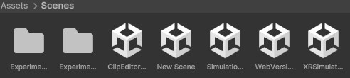

### Simulation scene

The simulation scene simulates a swarm.

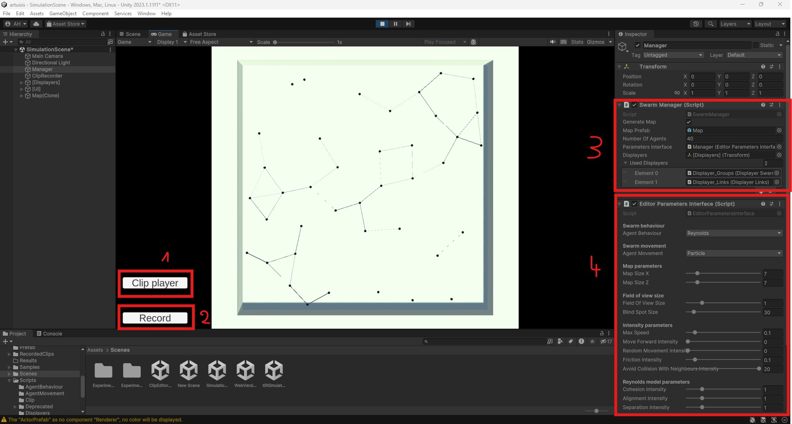

On the screenshot, there are :
1) The "Clip player" button change the current scene to the _ClipEditor_ scene.
2) The "Record" button start the recording of the simulation. To stop and save the recording, press the button a second time. Log can be found in the Unity console. The recorded clip is stored in the [_RecordedClips_](./Assets/RecordedClips) folder, under the name "clip_\[_datetime_\].dat". 
3) The [**SwarmManager.cs**](./Assets/Scripts/SwarmManager.cs) script to modify certain parameters at initialisation. However, "Used Displayer" parameter can be changed during the play mode.
4) The [**EditorParameterInterface.cs**](./Assets/Scripts/EditorParametersInterface.cs) script allows to change various swarm control parameters, before or during the play mode.

This two scripts can be found in the _Manager_ game object in the scene hierarchy. 

### Clip editor scene

The clip editor scene provides tools for viewing recorded clips, using various visualisations, and trimming them if necessary.

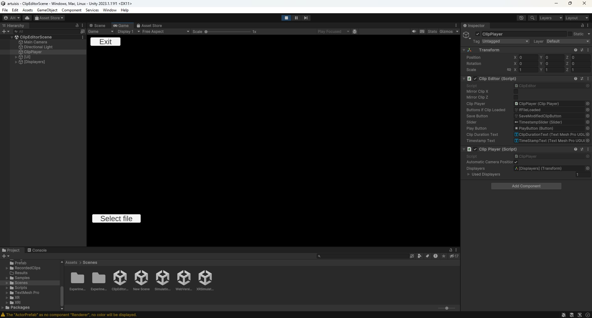

On the screenshot, only two buttons are available. "Exit" button works only on built version, and close the app. The "Select file" button is used to select a clip file for loading. Once the clip has been loaded, the interface changes.

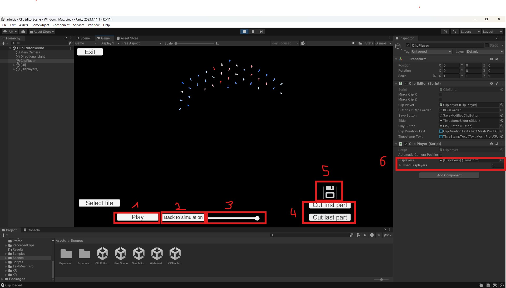

On the screenshot, there are :
1) The "Play" button is used to play or pause the clip.
2) The "Back to simulation" button uses the current frame of the clip to restart the simulation in the _SimulationScene_. It allows to test different alternative of the same simulation.
3) The cursor allows you to move through the clip in time, even when it is paused. The time in seconds is displayed in black above the cursor (it is not visible against this black background).
4) Those two buttons allow to remove the first part of the clip or the last part, based on the position of the cursor.
5) This floppy disk button appears once a cut has been applied to the clip. This button save the clip under the name "\[_originalClipName_\]_mod.dat"
6) In the _ClipPlayer_ game object, the **ClipPlayer.cs** script allows to change the swarm visualisation, by adding or removing displayers.

### Web version scene

The purpose of the web version scene is to provide the simulation scene in a web format. It provides sliders directly in the game interface to change various swarm parameters. 

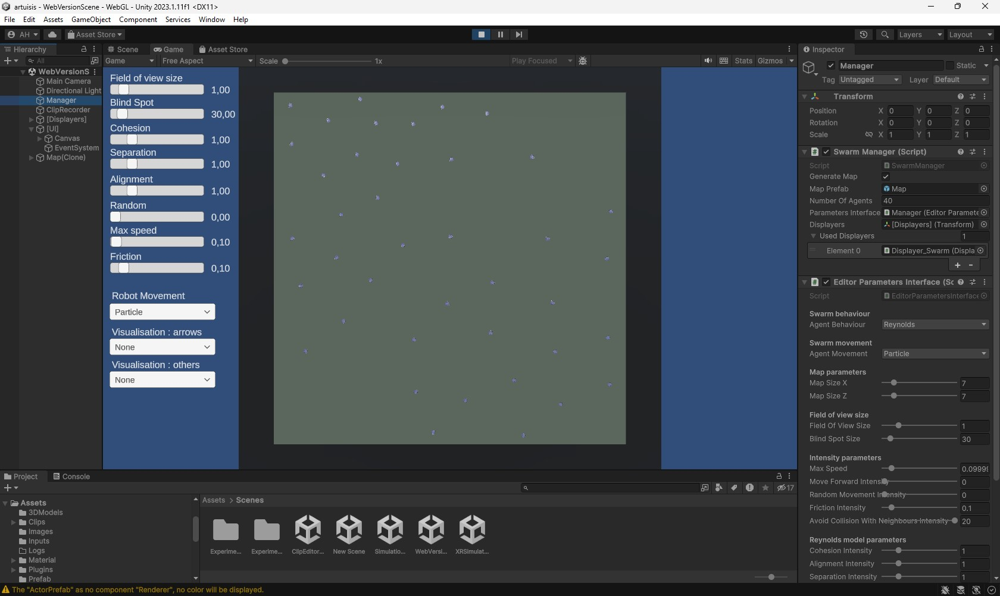

### XR simulation scene 

The purpose of the XR simulation scene is to provide the simulation scene using an XR device (particulary a VR device).

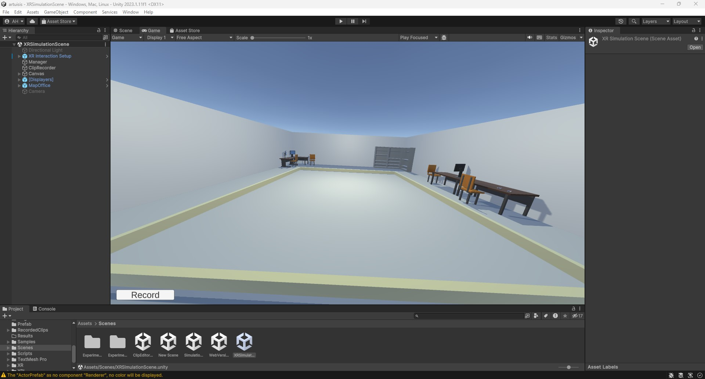

### Sub-folders scenes

Other scenes contained in sub-folders have been created for experimental purposes.

## Architecture 

### Clip data model (and swarm)

This screenshot shows the data model of a clip.
A clip is a regular multivariate time series, corresponding to a regular succession of swarm states. Each swarm state is composed of agents, a random generator and a set of parameters. To save a clip, this data structure is serialized (cf. [**SwarmClip.cs**](./Assets/Scripts/Clip/SwarmClip.cs)).

### Displayers

Whether to display the swarm, links, arrows or any other visualisations, a ‘displayer’ system is used.

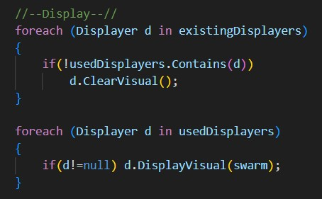

As you can see from the screenshot (from the [**SwarmManager.cs**](./Assets/Scripts/SwarmManager.cs), but the [**ClipPlayer.cs**](./Assets/Scripts/Clip/ClipPlayer.cs) also use displayers), all the views are displayed on the screen in the same way. First, all the views are deleted, then the desired ones are displayed. 
The method **ClearVisual** and **DisplayVisual**, used to hide and show visualisations, can be found in [**Displayer.cs**](./Assets/Scripts/Displayers/Displayer.cs).

### Agent actualisation

#### Behaviour
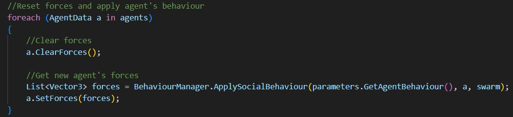

To apply swarm behaviour to agents, previously applied forces are cleared, then the selected behaviour (depending on the **AgentBehaviour** parameter contained in [**SwarmParameters.cs**](./Assets/Scripts/SwarmParameters.cs)) is applied to the agent, adding the new forces. See screenshot taken from the [**SwarmManager.cs**](./Assets/Scripts/SwarmManager.cs).

#### Acceleration and speed

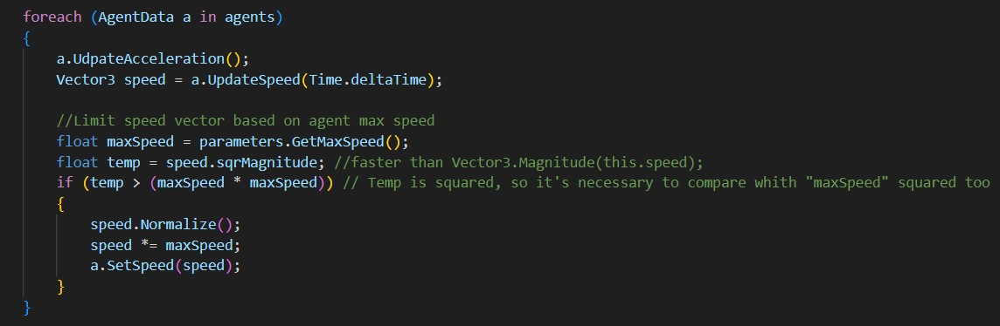

To update an agent's acceleration, the **UpdateAcceleration** method is used. This method adds together all the forces experienced by the agent.
Then, the speed is updated using the **UpdateSpeed** method, taking into account the time elapsed since the last update (in parameter).
Finally, the agent's speed is reduced if it exceeds the maximum authorised speed.
See screenshot taken from the [**SwarmManager.cs**](./Assets/Scripts/SwarmManager.cs).

#### Position and direction

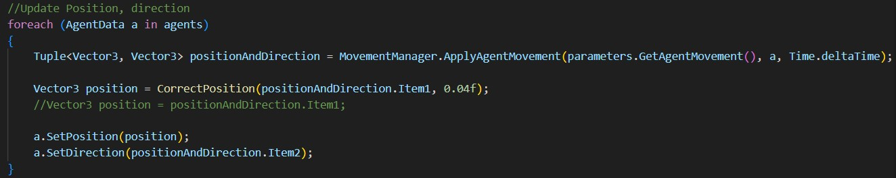

To apply swarm movement to agents, the selected movement (depending on the **AgentMovement** parameter contained in [**SwarmParameters.cs**](./Assets/Scripts/SwarmParameters.cs)) is applied to the agent, updating position and direction.
See screenshot taken from the [**SwarmManager.cs**](./Assets/Scripts/SwarmManager.cs).

## How to 

### Create a displayer (a new visualisation)

To create a new display, you need to implement a class that inherits from the [**Displayer.cs**](./Assets/Scripts/Displayers/Displayer.cs) class. This class contains two methods that need to be implemented in the child class (see next image).

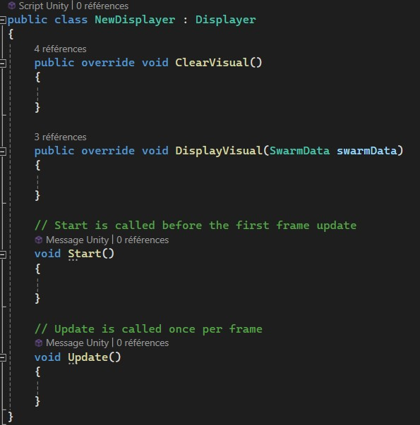

- **DisplayVisual** is the method called to display the desired elements.   
- **ClearVisual** is the method used to clear the items displayed (and free up the memory used). Ideally, this method is called at the beginning of the **DisplayVisual** method to clear the previous display before displaying the new elements.

You then need to create a GameObject in the Unity scene hierarchy, or ideally in the prefab named "**[Displayers]**" (see the [_Prefab_](./Assets/Prefab) folder), which contains all the displayers and is used in several scenes.

Finally, for the displayer created to be used when the scene is executed, it must be added to the displayers used, for example in "**SwarmManager**" (see the following image). By adding the displayer to the "**UsedDisplayer**" list, its "**DisplayVisual**" method will be called regularly and the display will be performed.

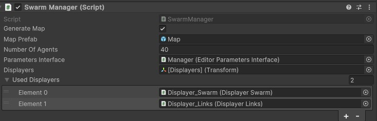

### Create a swarm behaviour

To create a new swarm behaviour, it is necessary to create a new method which returns a list of forces. This is because the swarm agents in this simulator move using virtual forces. Several existing methods can be used as examples (see [**BehaviourManager.cs**](./Assets/Scripts/AgentBehaviour/BehaviourManager.cs)). The methods in the [**BehaviourRules.cs**](./Assets/Scripts/AgentBehaviour/BehaviourRules.cs) script can be used to create the new behaviour. Once the method has been created, you need to :
- Add a category to the _AgentBehaviour_ enum, for example _Vicsek_ if the behaviour implemented is Vicsek's collective motion.
- Next, in the _switch_ of the **ApplySocialBehaviour** method, you need to add an entry calling the created behaviour, from the category created in the enum.

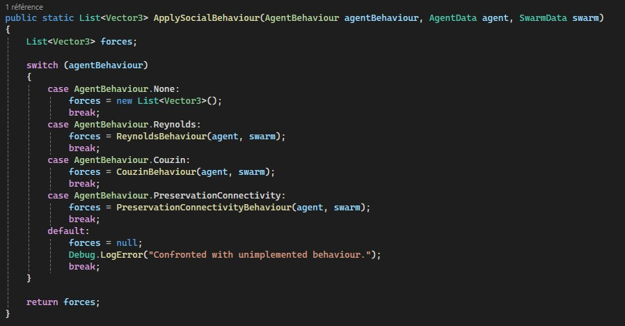

Finally, to use the new behaviour in the simulation, you need to select it in [**SwarmParameters.cs**](./Assets/Scripts/SwarmParameters.cs), for example using the script [**EditorParameterInterface.cs**](./Assets/Scripts/EditorParametersInterface.cs) in the editor (see next image).

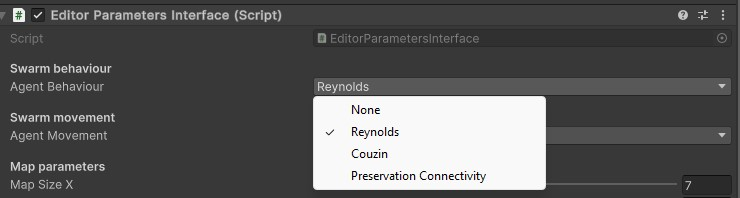

### Create a swarm movement

To create a new type of swarm movement, it is necessary to create a method in [**MovementManager.cs**](./Assets/Scripts/AgentMovement/MovementManager.cs) which returns the new position of an agent in the swarm. Once the method has been created, you need to :
- Add a category to the _AgentMovement_ enum, for example Mona if the agent needs to move like a Mona robot.
- Next, in the switch of the **ApplyAgentMovement** method, you need to add an entry calling the created movement, from the category created in the enum.

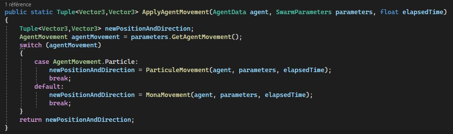

Finally, to use the new movement in the simulation, you need to select it in [**SwarmParameters.cs**](./Assets/Scripts/SwarmParameters.cs), for example using the script [**EditorParameterInterface.cs**](./Assets/Scripts/EditorParametersInterface.cs) in the editor (see next image).

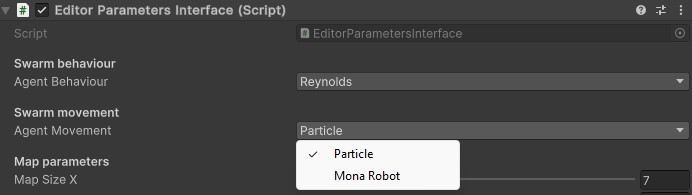